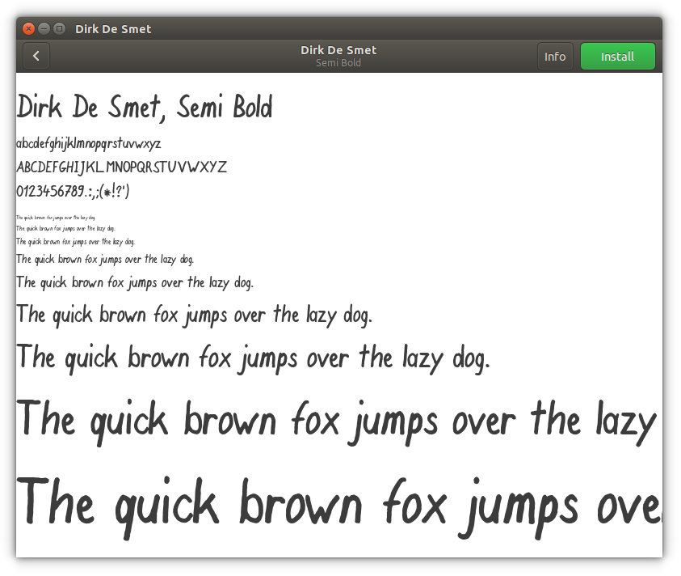

# Dirk De Smet, a semi-bold font
My personal handwriting, written with a _"STABILO Pen 68"_ felt-tip pen, scanned in and afterwards processed with [Birdfont](https://birdfont.org) into a font.

I created this font because I almost never write things by hand anymore, in these digital times.
Whenever I want to write anything more than a post-it note, the palm of my hand already starts begging for a keyboard. :)

My font gives me the opportunity to "write" as much as I want, without losing my personal touch.

Feel free to use my handwriting in any of your projects, but I would greatly appreciate it if you could show me the result afterwards.

_(To be honest, I would be very surprised if anyone would use the font of my mediocre handwriting - but you never know...)_

